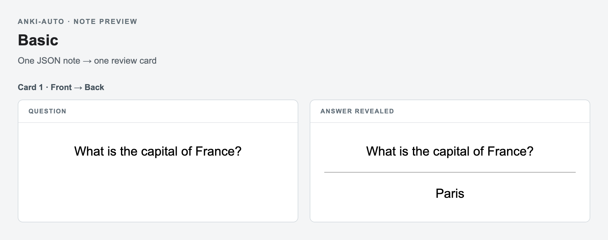
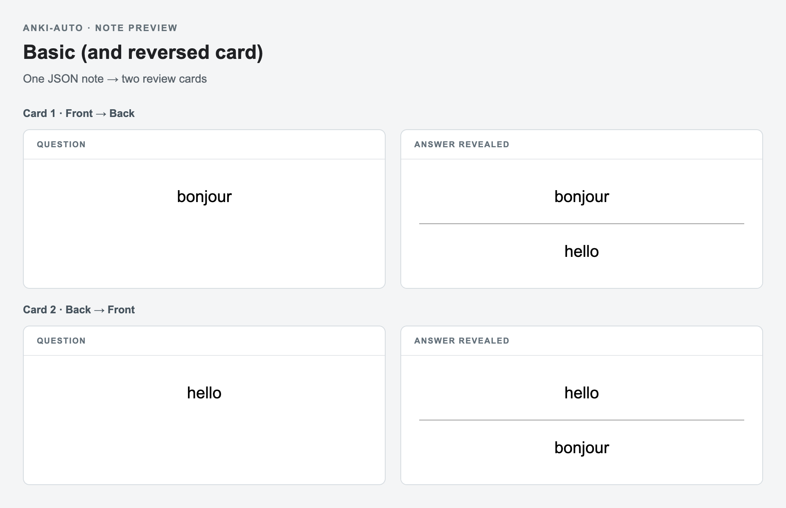
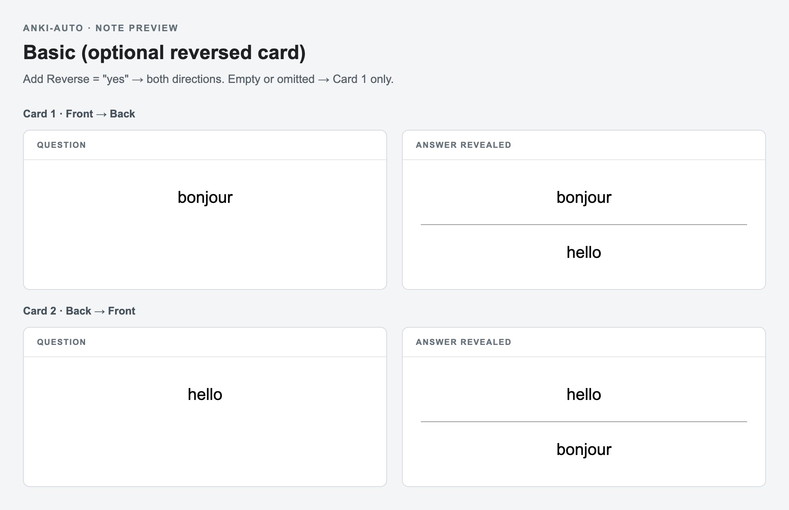
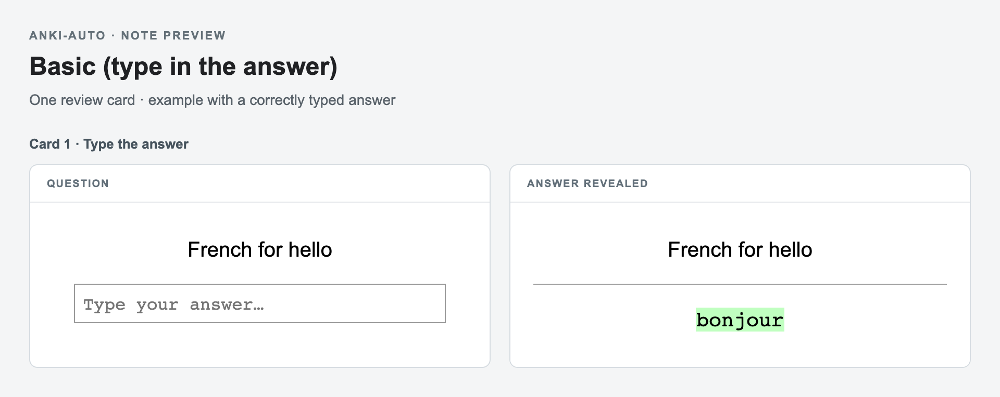
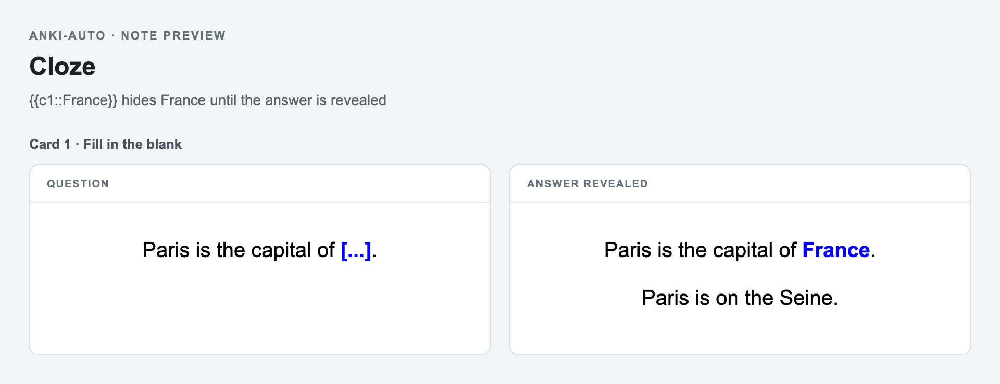
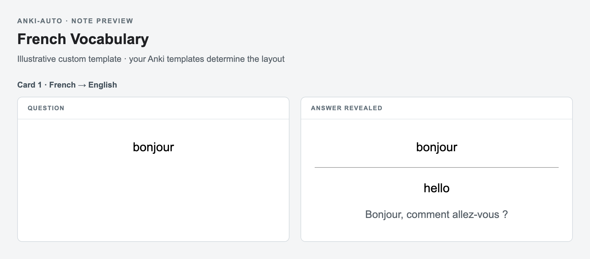
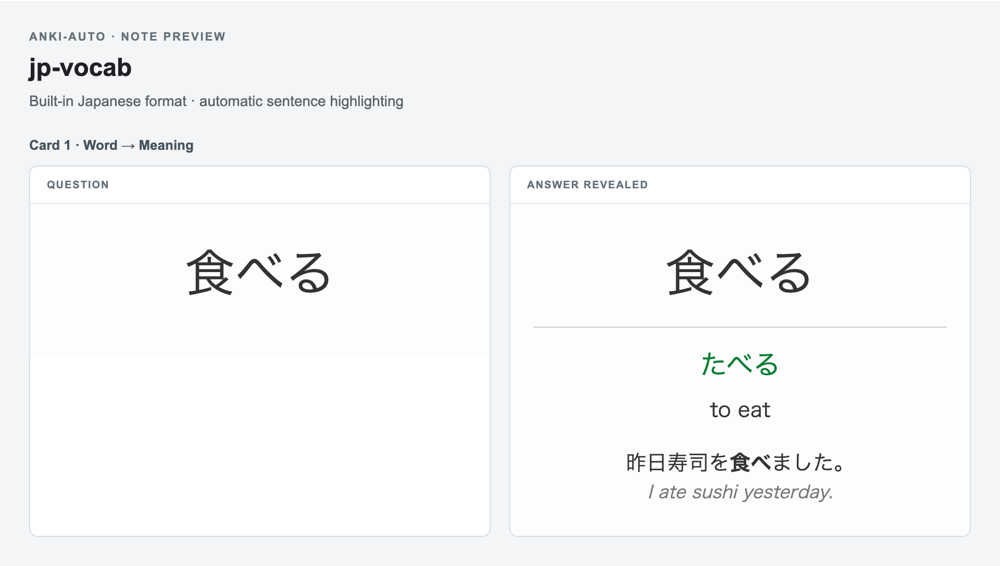

# anki-auto

`anki-auto` imports JSON cards into your Anki decks through AnkiConnect. Use any existing note type with `--model`, or use the built-in Japanese vocabulary format. It validates input, skips duplicates, tags source provenance, and optionally syncs. No AI API key or hosted service is needed.

## Prerequisites

- Anki installed with the AnkiConnect add-on enabled (add-on code `2055492159`)
- AnkiWeb configured in Anki if you want sync
- Rust with Cargo, or Nix for the development shell
- For the Codex YouTube workflow: an awake laptop, internet access, and Codex opened in this project

Anki does not have to be open initially: on macOS the CLI attempts to launch it and waits for AnkiConnect. This is laptop-local automation and does not run while the laptop is asleep.

## Quick start with your own deck

Clone this repository, then install the CLI from its directory:

```sh
cargo install --path . --locked
```

Alternatively, `nix develop` provides Rust and the `aa` shortcut for `cargo run --quiet --`. Examples below using `aa` also work with the installed `anki-auto` command.

Create `cards.json` with keys matching your Anki note type's field names exactly (including capitalization). For the standard `Basic` note type:

```json
[
  { "Front": "What is the capital of France?", "Back": "Paris" }
]
```

```sh
anki-auto import cards.json --deck Geography --model Basic --dry-run
anki-auto import cards.json --deck Geography --model Basic --source "Geography notes" --sync
```

The deck is created if needed. The note type must already exist in Anki; its templates and styling control how cards look. Custom input values are strings passed through unchanged, including Anki HTML, cloze markup, and existing media references. Media uploading is not included.

The first field **in the Anki note type's field order** must be present and non-empty; it is the duplicate key, regardless of JSON key order. Other fields may be omitted or empty. Duplicates are skipped within a batch and within the selected deck (including subdecks) for the same note type. Different note types can share the same first-field value.

`--dry-run` checks JSON structure and values without contacting Anki. During import, the CLI also checks field names and the required first field against the actual note type before creating the deck or adding notes. Unknown fields or missing note types fail with an error. A cloze note type additionally requires valid cloze markup for Anki to generate cards.

For ongoing file imports:

```sh
anki-auto watch --inbox inbox --deck Geography --model Basic --tags study
```

For an agent-driven workflow, tell your agent the target deck, note type, and exact fields, and ask it to produce JSON, dry-run it, then import. The YouTube/Japanese instructions in this repository are an example workflow; custom cards do not need Japanese vocabulary fields.

AnkiConnect defaults to `http://127.0.0.1:8765`; override it with `ANKI_CONNECT_URL`. On Linux or Windows, start Anki manually.

## Note type examples

Find your exact note type name under **Tools → Manage Note Types** in Anki; select it and click **Fields** to see its field names and order. Names may differ if you renamed them or use another interface language. These examples assume the standard English names described in the [Anki manual](https://docs.ankiweb.net/getting-started.html#note-types).

Save each JSON example to the filename shown in its command. Run the command with `--dry-run` first, then replace `--dry-run` with `--sync` to import and sync. Counts reported by the CLI are **notes**, which can generate more than one review card.

The images below are browser-rendered previews of the example data, with the question on the left and revealed answer on the right. Standard examples follow [Anki's stock templates](https://github.com/ankitects/anki/blob/main/rslib/src/notetype/stock.rs); the custom template is illustrative. Your templates, theme, and device can change the appearance.

### Basic

One question-and-answer card per note:

```json
{ "Front": "What is the capital of France?", "Back": "Paris" }
```



```sh
anki-auto import basic.json --deck Geography --model Basic --dry-run
```

### Basic (and reversed card)

Two cards per note: French → English and English → French.

```json
{ "Front": "bonjour", "Back": "hello" }
```



```sh
anki-auto import reversed.json --deck French --model "Basic (and reversed card)" --dry-run
```

### Basic (optional reversed card)

Set `Add Reverse` to any non-empty string to generate the reverse card; omit it or leave it empty for just the forward card.

```json
{ "Front": "bonjour", "Back": "hello", "Add Reverse": "yes" }
```



```sh
anki-auto import optional-reversed.json --deck French --model "Basic (optional reversed card)" --dry-run
```

### Basic (type in the answer)

Uses the same fields as Basic, with a typed-answer prompt in Anki:

```json
{ "Front": "French for hello", "Back": "bonjour" }
```



```sh
anki-auto import typed.json --deck French --model "Basic (type in the answer)" --dry-run
```

### Cloze

Use `{{c1::answer}}` inside `Text` for a blank. Different numbers (`c1`, `c2`, etc.) generate separate cards; `Back Extra` is optional. See [Anki's cloze documentation](https://docs.ankiweb.net/editing.html#cloze-deletion).

```json
{
  "Text": "Paris is the capital of {{c1::France}}.",
  "Back Extra": "Paris is on the Seine."
}
```



```sh
anki-auto import cloze.json --deck Geography --model Cloze --dry-run
```

### Your own note type

For an existing note type named `French Vocabulary`, with `French` as its first field and additional `English` and `Example` fields:

```json
{
  "French": "bonjour",
  "English": "hello",
  "Example": "Bonjour, comment allez-vous ?"
}
```



```sh
anki-auto import french.json --deck French --model "French Vocabulary" --dry-run
```

Use your own field names and note type name. Templates stay in Anki; the importer passes field values through.

The built-in Japanese format is shown in the CLI section below. It uses lowercase vocabulary keys and automatically creates `jp-vocab`; omit `--model` for that format.

## Codex workflow

Ask Codex in this project, for example:

> Make Anki cards from this YouTube video: https://www.youtube.com/watch?v=VIDEO_ID

> Make Anki cards from these YouTube videos: https://youtu.be/VIDEO_1 and https://youtu.be/VIDEO_2. Focus on intermediate vocabulary.

> I didn't get enough passive Japanese immersion today. Find videos similar to sources I've used before and create 20 cards.

The repository instructions tell Codex to retrieve available Japanese captions, make only transcript-grounded cards, validate them with a dry run, import each source directly without clipboard copying, and sync. In discovery mode, Codex reads prior source tags, searches for similar captioned material, and treats the requested number as a total of newly added cards across all videos. It keeps looking after duplicate skips when supported vocabulary remains, but never fabricates or pads cards; if it cannot safely reach the target, it reports the achieved count and why.

Discovery intentionally stays agent-driven: Codex performs live search and qualitative similarity judgment. The Rust CLI does not contain a YouTube recommendation algorithm or require an AI/API key; it is responsible only for exposing provenance and safely validating, deduplicating, importing, and syncing cards.

## CLI

The input can be one card object or an array:

```json
{
  "word": "食べる",
  "reading": "たべる",
  "meaning": "to eat",
  "sentence": "昨日寿司を食べました。",
  "sentence_meaning": "I ate sushi yesterday."
}
```



`sentence_meaning` is optional. Required fields must be non-empty.

```sh
# Validate only; never contacts or launches Anki
aa import cards.json --dry-run --source "Video title https://youtu.be/VIDEO_ID"

# Import, tag provenance, and sync in one invocation
aa import cards.json --tags youtube --source "Video title https://youtu.be/VIDEO_ID" --sync

# Retry sync without re-importing
aa sync

# Read-only source history for discovery (most-used first)
aa sources
aa sources --deck Japanese --limit 10

# Existing stdin and watch workflows remain available
printf '%s\n' "$CARDS_JSON" | aa import --source "source name"
aa watch --inbox inbox --tags youtube
```

If notes import successfully but sync fails, the CLI reports the imported counts, exits with an error, and directs you to retry with `aa sync`. The already-imported notes are not rolled back.

## Development safety

Tests do not require a live Anki instance and must not import into or sync a real collection. Use `--dry-run` for manual CLI checks. If an explicitly authorized live integration check is ever necessary, target a disposable deck explicitly:

```sh
aa import test-cards.json --deck anki-auto-test --source "local integration test"
```

Never rely on the default `Japanese` deck for development or testing. The Codex production workflow imports only after an actual user request to make cards.

## Contributing and license

Contributions are welcome through pull requests; see [CONTRIBUTING.md](CONTRIBUTING.md). Changes to `main` require owner review.

Licensed under [MIT](LICENSE).
